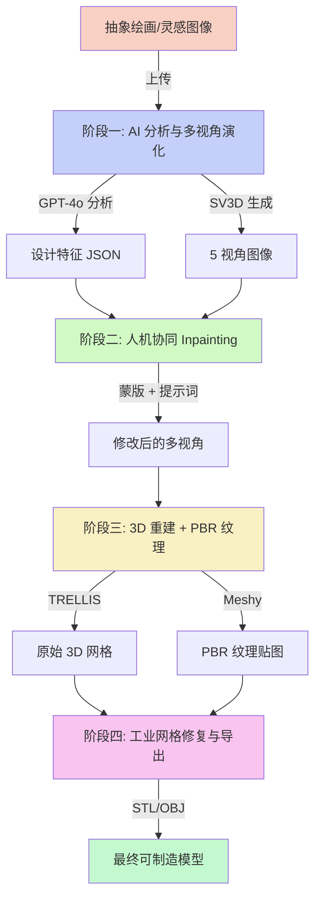

# 创意设计管线 (Creative Design Pipeline)

> 从抽象绘画到工业级 3D 模型的全自动化 4 阶段管线

## 1. 系统架构蓝图

### 整体数据流



### 四阶段详细流程

```
┌──────────────────────────────────────────────────────────────────┐
│                        创意设计管线                                │
├──────────────────────────────────────────────────────────────────┤
│                                                                  │
│  ┌─────────────┐    ┌─────────────┐    ┌─────────────┐          │
│  │   阶段一     │    │   阶段二     │    │   阶段三     │          │
│  │  AI 分析    │───▶│  Inpainting │───▶│  3D 重建    │          │
│  │  + 多视角   │    │  修改       │    │  + 纹理     │          │
│  └─────────────┘    └─────────────┘    └──────┬──────┘          │
│                                                 │                │
│                                                 ▼                │
│                                        ┌─────────────┐          │
│                                        │   阶段四     │          │
│                                        │  网格修复    │          │
│                                        │  + 导出     │          │
│                                        └──────┬──────┘          │
│                                               │                 │
│                                               ▼                 │
│                                        ┌─────────────┐          │
│                                        │ STL / OBJ   │          │
│                                        │ 可制造模型   │          │
│                                        └─────────────┘          │
└──────────────────────────────────────────────────────────────────┘
```

### 阶段四核心算法流程

```
原始 3D 模型
    │
    ▼
[加载模型] ─── trimesh.load()
    │
    ▼
[网格修复] ─── fix_normals() + remove_degenerate() + merge_vertices()
    │
    ▼
[流形检测] ─── is_watertight + euler_number + boundary_check
    │
    ├── 水密 ──▶ 跳过
    │
    └── 非水密 ──▶ [孔洞填充]
                      │
                      ├── 边界环检测
                      ├── ear-clipping 三角化
                      └── Delaunay 三角化（降级方案）
    │
    ▼
[质心计算] ─── 体积积分（水密）/ 面积加权（非水密）
    │
    ▼
[配重腔体] ─── 质心高度比 > 阈值？
    │               │
    │          是 ──┼── 截面 + 偏移 + 布尔差集
    │               │
    │          否 ──┘
    ▼
[重网格化] ─── pymeshlab 各向同性重网格 / trimesh 细分
    │
    ▼
[最终检测] ─── 流形 + 水密验证
    │
    ▼
[导出] ─── STL (二进制) / OBJ (含法线)
    │
    ▼
最终可制造模型 + 统计信息
```

## 2. 技术栈说明

| 层级 | 技术 | 说明 |
|------|------|------|
| Web 框架 | FastAPI + Uvicorn | 异步高性能 API 框架 |
| 数据验证 | Pydantic v2 + pydantic-settings | 请求/响应模型 + 环境配置 |
| AI 视觉分析 | OpenAI GPT-4o Vision | 多模态图像理解 |
| 多视角生成 | SV3D | 单图 → 5 视角生成 |
| 图像修复 | Stable Diffusion Inpainting | 蒙版区域重绘 |
| 3D 重建 | TRELLIS / Hunyuan3D | 多视角 → 3D 网格 |
| PBR 纹理 | Meshy API | 物理材质纹理生成 |
| 网格处理 | trimesh + pymeshlab | 修复、检测、重网格化 |
| 数值计算 | NumPy + SciPy | 线性代数 + 三角化 |
| HTTP 客户端 | httpx | 异步 API 调用 |

## 3. API 接口文档

### 3.1 阶段一：分析与演化

```
POST /api/v1/analyze-and-evolve
Content-Type: multipart/form-data

参数:
  - inspiration_image: File (必填) - 灵感图像文件

响应:
{
  "session_id": "abc123def456",
  "design_features": {
    "emotion_symbols": ["自由", "流动", "生命力"],
    "primary_colors": ["#2C3E50", "#E74C3C", "#F39C12"],
    "material_guess": "陶瓷",
    "style_description": "有机曲面与几何切割的融合...",
    "structural_keywords": ["流线型", "有机曲面", "不对称"]
  },
  "multi_view_paths": [
    "/outputs/abc123def456/multi_views/view_front.png",
    "/outputs/abc123def456/multi_views/view_back.png",
    "/outputs/abc123def456/multi_views/view_left.png",
    "/outputs/abc123def456/multi_views/view_right.png",
    "/outputs/abc123def456/multi_views/view_top.png"
  ],
  "inspiration_image_path": "/uploads/abc123def456/inspiration.png"
}
```

### 3.2 阶段二：设计修改

```
POST /api/v1/modify-design
Content-Type: multipart/form-data

参数:
  - selected_view_index: int (必填) - 视角索引 (0-4)
  - mask_image: File (必填) - 蒙版图像
  - prompt_text: str (必填) - 修改提示词
  - session_id: str (必填) - 会话 ID

响应:
{
  "session_id": "abc123def456",
  "selected_view_index": 0,
  "updated_view_path": "/outputs/abc123def456/modified_views/view_front_modified.png",
  "updated_multi_view_paths": [
    "/outputs/abc123def456/modified_views/view_front_modified.png",
    "/outputs/abc123def456/modified_views/view_back_propagated.png",
    ...
  ]
}
```

### 3.3 阶段三：3D 重建

```
POST /api/v1/generate-3d-raw
Content-Type: multipart/form-data

参数:
  - multi_view_paths: str (必填) - 多视角路径，逗号分隔
  - material_type: str (可选, 默认 "ceramic") - 材质类型
  - roughness: float (可选, 默认 0.5) - 粗糙度
  - metallic: float (可选, 默认 0.0) - 金属度
  - color_hint: str (可选, 默认 "#FFFFFF") - 颜色提示
  - session_id: str (必填) - 会话 ID

响应:
{
  "session_id": "abc123def456",
  "raw_model_path": "/outputs/abc123def456/3d_model/raw_model.glb",
  "texture_paths": {
    "albedo": "/outputs/abc123def456/textures/albedo.png",
    "normal": "/outputs/abc123def456/textures/normal.png",
    "roughness": "/outputs/abc123def456/textures/roughness.png",
    "metallic": "/outputs/abc123def456/textures/metallic.png"
  }
}
```

### 3.4 阶段四：修复与导出

```
POST /api/v1/finalize-and-export
Content-Type: multipart/form-data

参数:
  - raw_model_path: str (必填) - 原始模型路径
  - export_format: str (可选, 默认 "stl") - 导出格式
  - enable_auto_fix: bool (可选, 默认 true) - 是否自动修复
  - session_id: str (可选) - 会话 ID

响应:
{
  "session_id": "abc123def456",
  "final_model_path": "/outputs/abc123def456/final_model.stl",
  "mesh_stats": {
    "vertices": 52480,
    "faces": 104960,
    "volume": 125678.9012,
    "bounding_box": {
      "min": [-50.0, -30.0, 0.0],
      "max": [50.0, 30.0, 80.0],
      "size": [100.0, 60.0, 80.0]
    }
  },
  "center_of_mass": {"x": 0.5, "y": -0.2, "z": 35.8},
  "is_manifold": true,
  "holes_fixed": 3,
  "export_format": "stl"
}
```

## 4. 阶段四核心算法说明

### 4.1 网格修复 (repair_mesh)

采用多步骤修复策略：

1. **法线修复**: 调用 `fix_normals()` 确保所有面法线朝外一致
2. **退化面移除**: 计算每个三角面的面积，移除面积小于 `1e-10` 的退化面
3. **顶点合并**: `merge_vertices()` 合并完全相同的顶点，`remove_duplicate_faces()` 移除重复面
4. **自交检测**: 使用 `intersects_self()` 检测并移除自交面
5. **空腔清理**: 对水密网格使用体素化方法填充内部空腔

### 4.2 流形检测 (check_manifold)

流形网格是 3D 打印的基本要求：

- **水密性检测**: `is_watertight` - 检查网格是否完全封闭
- **欧拉数验证**: 对于水密网格，欧拉数应等于 2（V - E + F = 2）
- **边界检测**: 统计开放边数量，0 表示水密
- **非流形边检测**: 检查被 3 个及以上面共享的边

### 4.3 孔洞填充 (fill_holes)

1. **边界环检测**: 找出只被一个面共享的边，组织成有序边界环
2. **三角化填充**:
   - 优先使用 **Delaunay 三角化**（需 scipy）
   - 自动选择最佳投影平面（XY/YZ/XZ）
   - 降级方案：**扇形三角化** (fan triangulation)
3. **法线一致性**: 确保填充面的法线方向与边界环法线一致

### 4.4 质心计算 (compute_center_of_mass)

- **水密网格**: 使用 `center_mass` 属性（基于体积积分的精确计算）
- **非水密网格**: 使用面积加权平均（每个面的中心按面积加权）

### 4.5 配重腔体生成 (generate_weight_cavity)

当质心高度超过模型高度的 60% 时自动触发：

1. 在质心高度处截取横截面
2. 将截面向内偏移 `wall_thickness` 生成内轮廓
3. 将内轮廓拉伸为腔体网格
4. 使用布尔差集从原模型中减去腔体
5. 效果：降低整体质心，提高稳定性

### 4.6 重网格化 (remesh_quad)

- **优先方案**: pymeshlab 各向同性重网格化（`meshing_isotropic_explicit_remeshing`）
- **降级方案**: trimesh 的 `simplify_quadric_decimation`（面数过多时简化）或 `subdivide`（面数不足时细分）

## 5. 部署指南

### 5.1 环境要求

- Python 3.10+
- CUDA 11.8+（GPU 推理需要）

### 5.2 快速启动

```bash
# 1. 克隆项目
cd backend/creative-design

# 2. 创建虚拟环境
python -m venv venv
source venv/bin/activate  # Linux/Mac
# 或 venv\Scripts\activate  # Windows

# 3. 安装依赖
pip install -r requirements.txt

# 4. 配置环境变量
cp .env.example .env
# 编辑 .env 填入 API Key

# 5. 启动服务
uvicorn app.main:app --host 0.0.0.0 --port 8000 --reload

# 6. 访问 API 文档
# http://localhost:8000/docs
```

### 5.3 Docker 部署

```dockerfile
FROM python:3.11-slim

WORKDIR /app
COPY requirements.txt .
RUN pip install --no-cache-dir -r requirements.txt

COPY . .

EXPOSE 8000
CMD ["uvicorn", "app.main:app", "--host", "0.0.0.0", "--port", "8000"]
```

### 5.4 外部服务依赖

| 服务 | 默认地址 | 说明 |
|------|----------|------|
| SV3D | localhost:7860 | 多视角生成 |
| TRELLIS | localhost:7860 | 3D 重建 |
| SD Inpainting | localhost:7862 | 图像修复 |
| Meshy | api.meshy.ai | PBR 纹理（云服务） |
| OpenAI | api.openai.com | GPT-4o 视觉分析 |

### 5.5 生产环境建议

1. 使用 Nginx 反向代理
2. 启用 HTTPS
3. 配置 CORS 白名单（替换 `allow_origins=["*"]`）
4. 使用 Gunicorn + Uvicorn workers
5. 配置日志收集（ELK / Loki）
6. 设置文件上传大小限制
